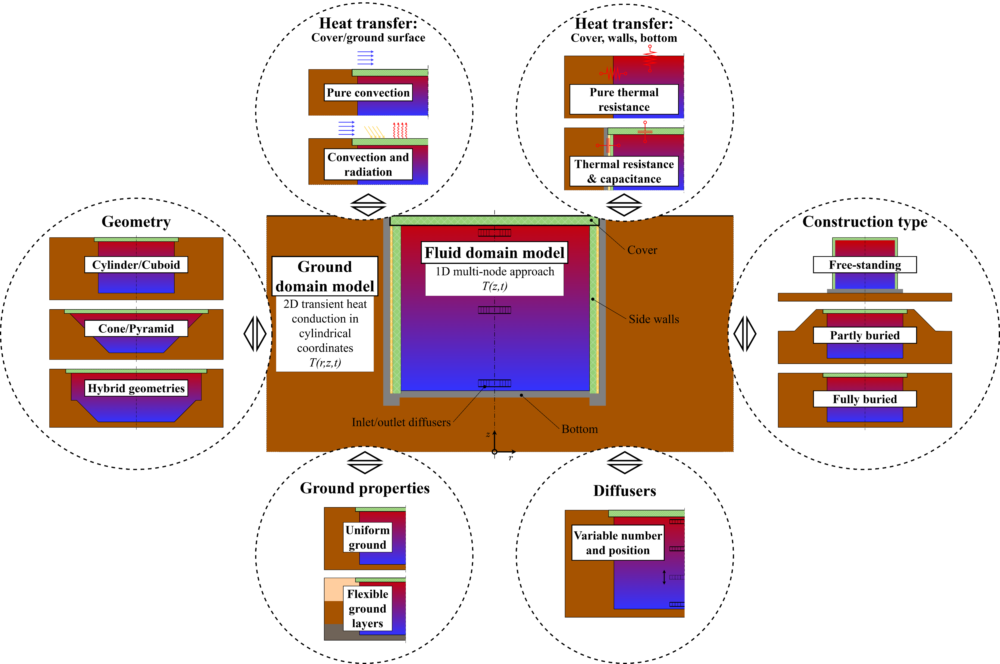

  

# Modelica LargeTESmtk Library

Welcome to the development site of the Modelica *LargeTESmtk* (LargeTESModelingToolkit) library.

## About

The *LargeTESmtk* is a Modelica-based toolkit for the modeling and simulation of large-scale pit (PTES) and tank (TTES) thermal energy storage systems. In addition to an easy-to-use Modelica library with thoroughly tested, pre-built storage models, the toolkit's features should provide the foundation for developing new storage models customized to the wanted application.

  <figure>
    
  </figure>

  <strong>Figure 1:</strong> Overview of <i>LargeTESmtk</i> features.

## Application

Possible applications of the library models are in simulations studies...
- ...to address relevant storage design questions (e.g., regarding volume, geometry, or insulation)
- ...to investigate long-term effects (e.g., the development of the storage performance and ground temperatures over the operation period)
- ...to evaluate the storage interaction in different system integration concepts (e.g., with solar thermal plants, heat pumps, or combined heat and power plants)
- ...

## Development Status

The library as well as many of the library's models exist in an initial version and have already been subjected to model verification and validation studies (see [Related Publications](#related-publications)). We are currently in the process of preparing these models for publication, which includes refining their structure, cleaning up the code, enhancing documentation, and improving usability, so that the first models will be released soon.

## Contact

For questions or feedback, please contact [m.reisenbichler@aee.at](mailto:m.reisenbichler@aee.at).

## Related Publications

- Reisenbichler-S., Michael, Franz Wotawa, Keith O’Donovan, Carles Ribas Tugores, and Franz Hengel. “LargeTESModelingToolkit: A Modelica Library for Large-Scale Thermal Energy Storage Modeling and Simulation.” In *Proceedings of the 15th International Modelica Conference*, 337–46. Aachen (DE), 2023. https://doi.org/10.3384/ecp204337.
- Reisenbichler, Michael, Keith O’Donovan, Carles Ribas Tugores, Wim van Helden, and Franz Wotawa. “Towards More Efficient Modeling and Simulation of Large-Scale Thermal Energy Storages in Future Local and District Energy Systems.” In *Proceedings of the 17th IBPSA Conference*, 2155–62. Bruges (BE): International Building Performance Simulation Association, 2021. https://doi.org/10.26868/25222708.2021.30911.
- Ochs, Fabian, Abdulrahman Dahash, Alice Tosatto, Michael Reisenbichler, Keith O’Donovan, Geoffroy Gauthier, Christian Kok Skov, and Thomas Schmidt. “Comprehensive Comparison of Different Models for Large-Scale Thermal Energy Storage.” In *Proceedings of the International Renewable Energy Storage Conference 2021 (IRES 2021)*, 36–51. Atlantis Press, 2022. https://doi.org/10.2991/ahe.k.220301.005.
- Schmidt, Thomas, and Abdulrahman Dahash. “Modelling Guidelines - Round Robin Test Case Description (for Comparative Simulations).” Task 39 - Large Thermal Energy Storages for District Heating: Subtask C - Round Robin Simulation. IEA ES TCP, June 19, 2024. https://iea-es.org/task-39/deliverables/.

